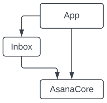
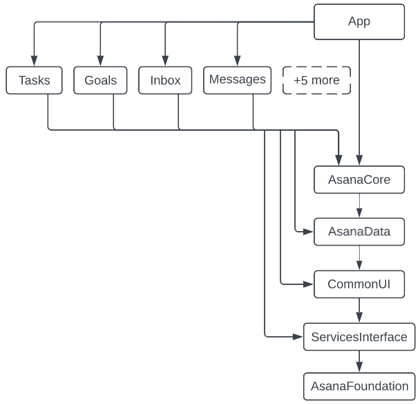
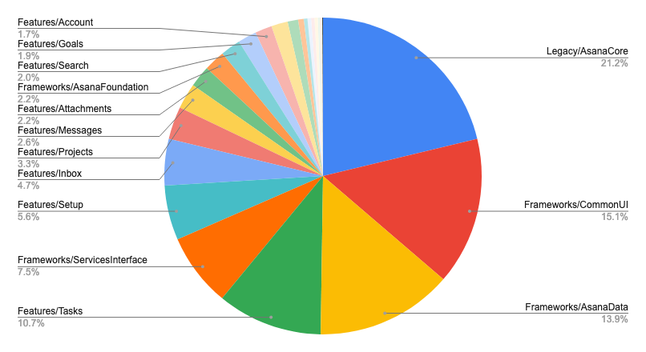

[Origin](https://blog.asana.com/2023/02/scaling-a-mature-ios-codebase-with-tuist/)

# Scaling a Mature iOS Codebase with Tuist
## Introduction
The Mobile Foundations team migrated Xcode project to Tuist and split the code into several modules, enabled by some modest refactors.

## The decision to make a change
* One way to make builds faster is to build less stuff each time, which in the Swift world means splitting code into modules.
* Two challenges: 
    - The developer experience of creating the modules
    - Refactoring code to allow different types to exist in different modules.

## Tuist’s advantages
* Tuist is a command-line tool that automates the creation of Xcode projects and workspaces.
* Swift code in a Tuist manifest has full access to the Foundation framework 
    - Automate nearly every task to be based on the filesystem, not manual configuration.
* Tuist’s output is an Xcode project

## Migrating to Tuist
* Lack of first-party support for CocoaPods. 
    - We needed to migrate all our CocoaPods dependencies to Swift Package Manager or Carthage.
* Migrate all our build settings to `.xcconfig` files using tuist __migration settings-to-xcconfig.__
* Once the Tuist manifest was in a state where engineers could reasonably be asked to use its output
    -  run __tuist generate__ on every __git checkout__, and removed the old Xcode project from source control.
    
## Refactoring to support modules
* Writing a Python script that could parse Swift code and mark every internal symbol in a file as __public__
* Other big problem was circular dependencies
    - Solved by using [µFeatures Architecture](https://docs.tuist.io/building-at-scale/microfeatures/)
    - It puts a feature’s public interface in its own module.
    
## Actually making the modules
* Put almost all of the code except __AppDelegate__ into a big module called __AsanaCore__
* The approach was to `lift` features upward out of __AsanaCore__, and `push` non-feature code downward out of __AsanaCore__ into more granular frameworks

## Where we are now
* Median build time is 15 seconds
* Module graph

* Module size

## Was it worth it?
* New problems
- `Tuist` is a complex new tool that only a minority of iOS engineers are comfortable with
- `git checkout` takes 5-15 seconds longer than it used to
- Using modules has forced us to write a bit more boilerplate code to separate interfaces from implementations
* New benefits
- Autocomplete works better with modules
- Treating project configuration as code makes sense when your app is complex
    - It’s easy to leave comments on changes to the Tuist manifest
    - Project-file-related merge conflicts are all gone
- Repetitive changes are easy to make
- Builds are much faster
