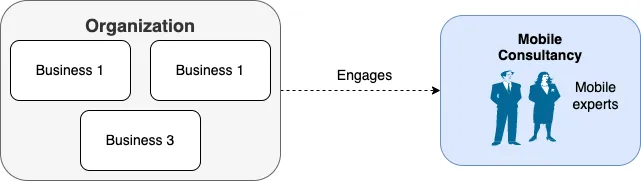
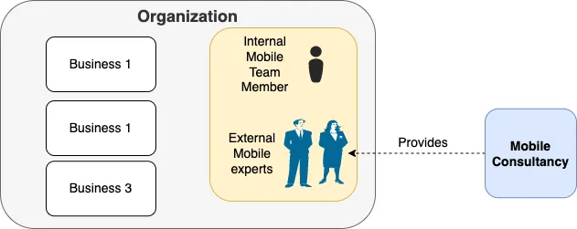
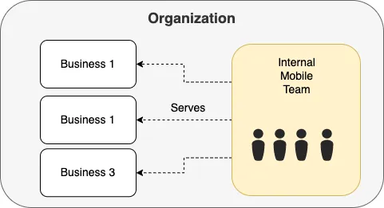
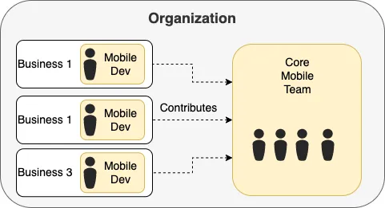
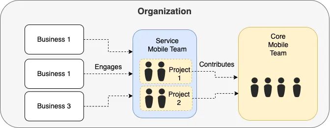
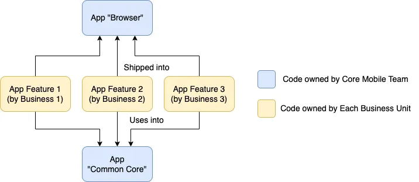
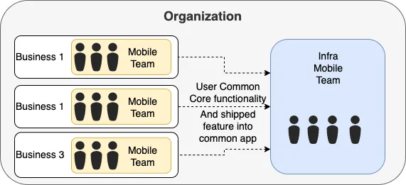
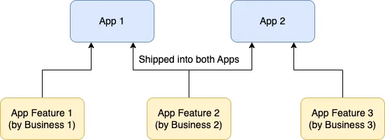

[Origin](https://medium.com/mobile-app-development-publication/the-change-of-mobile-teams-topology-for-an-organization-d6fb1f6ff75b)

# The Change of Mobile Teams Topology for an Organization
## Introduction
The different phases of app development and its suited mobile team topology

## Exploration Phase — No Topology

* During the early 2010s, the web is still the primary to the end user at that point in time
* The simplest solution is to approach external consultancy that focuses on the field of mobile domain, to aid. 

## More Control Phase — Joint Venture

* The smartphone industry continues to grow
* The organization start to realize one can no longer continue to fully rely on external consultancy for its mobile development.
* The better model is to consider hiring a handful (maybe 1 or 2 experience developers) and get them working with the external mobile consultant.
* The consultancy company just provides the __expertise__, but the project, code, and everything else is handled within the company.

## Independent Phase —Single Dedicated Team

* The mobile industry continues to grow, and even outgrowth the desktop web
* It’s time to expand the internal mobile team and release the external consultants. 

## Contribution Phase — The Federated Topology

* Instead of fully relying on the single mobile team
    - Each team now considers getting 1–2 mobile developers in the business team to help contribute to the mobile work.
    - This is called the Federation Model
* Each business will then be able to have its own mobile developer 
    - Focusing on its mobile development need
    - Contributing to the common mobile code base owned by the core mobile team.

## Consultation Phase — The Service Base Topology

* Consider regrouping the individual mobile dev in each business unit to form a Service Mobile Team.
* Each of the mobile dev in the Service Mobile Team will still support the business units by can be more dynamically assigned to relevant projects as needed.
* We can view this model as similar to an external mobile consultancy model one had in the past

## App as an Infra Phase — Business Focus Topology
* Each business unit should consider having its own mobile team to scale development
#### Paradigm shift the core to be infra instead

* The core team focuses on managing the abstract layer of the App
    - It's like building a `browser` and its `common core`
* The business units focus on delivering the content, that uses the `common core` and fed into the `browser`   
* __App Browser__  
    - Allow the App Feature to be shipped (integrated) into it so that it can be bundled together as a single app (into AppStore and PlayStore)
* __App Common Core__
    - Provides the common functionalities that synchronize across features, which make it possible for the __shipping__ and __shareability__ with other App Features.
* There are various ways to make this possible
    - E.g: Super Apps
* We view the Core Mobile Team as the Infra Mobile Team
    - They are no longer responsible for any business unit features
    - They are responsible for the common container (similar to the web browser) of the App content

#### Each team developed its own “mini-app”

* Each business unit can have its own mobile team developing independent App Features
    - That can be bundled as an independent App and shipped by itself if needed.
* Each App Feature is required to use the __common core__ (provided by the Infra Mobile Team) as its toolkit
    - To ensure this App Feature developed is __shippable__ and __shareable__ with other App Features
    
* The Organization also possibly ship different apps that bundle different App Features according to their app purpose.

## It’s a Hybrid and Dynamic World — It's Mobile!
* Having a Service Mobile Team serving some business units
* Some other business units have their own mobile team
* Some other teams engage external contract mobile developers for some interim work
