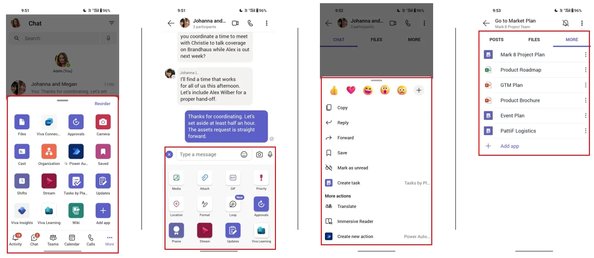
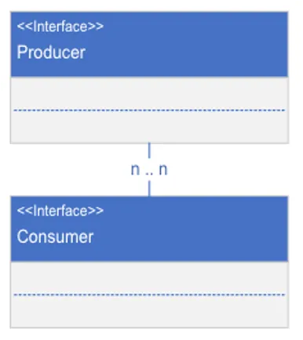
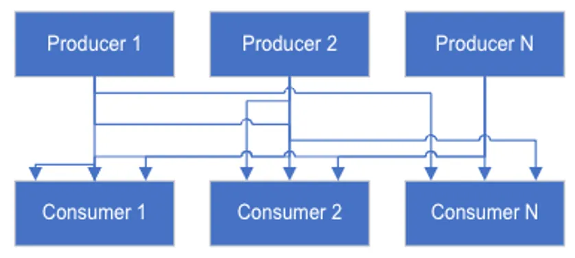
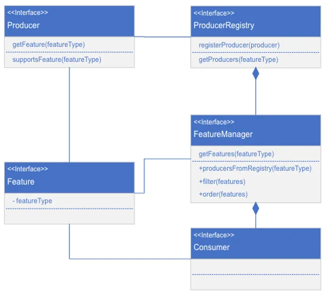
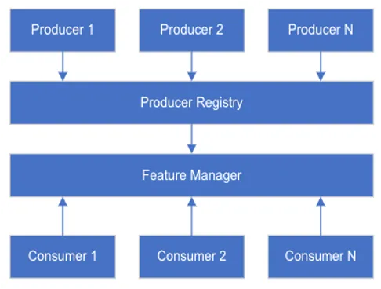

[Origin](https://medium.com/microsoft-mobile-engineering/scaling-teams-mobile-development-the-mental-model-8224afb1e4ba)

# Scaling Teams Mobile Development — The Mental Model
## Introduction
* How multiple partner teams working on a large code base can be streamlined by employing the contributor design pattern.
* Mission: Make partner integrations with Teams mobile 
    - Easier
    - Well segregated, with clear protocols.

## Teams    

Teams is a complex mobile application 
* A LOT of integration points.
* Partner surface their features through entry points.
* Producer-Consumer
    - Which is not implemented correctly

## The mental model that we built

* Entry points are consumers of features
* Partner teams are producers of features
* Each partner team directly integrated with the entry point
    - Each consumer had to know the producers directly
    - When a new producer was added, the consumer had to be updated
* Not a scalable model    
    - Need to decouple the producers and the consumers 
    - Build strong contracts between them
    
    
## Evolving this design pattern

* Define multiple __Feature__ interfaces 
    - Serve as a contacts between the producer and the consumer
    -  A producer may implement one or many Features
    -  A consumer always supports one type Feature
* Built a __Registry__ where the producers will register
* Built a __Manager__ which the consumers can query.

## End up with a system

* Producers are implemented in isolation in their own modules.
* Producer registers themselves in a central registry.
* Consumers consume the Features from the Producers through the Manager.
* Ordering, filtering, monitoring of Producers and their Features are centralized in the Manager.
* Consumers are safeguarded. Producers doesn’t even know about Consumers. 

