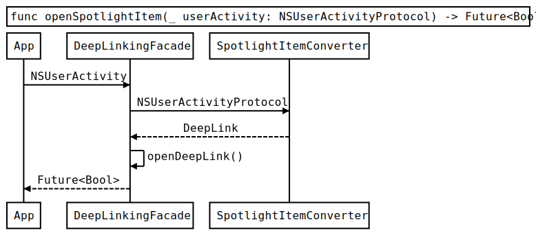

[Origin](https://albertodebortoli.com/2019/04/16/deep-linking-at-scale-on-ios/)

# Deep Linking at Scale on iOS
## Introduction
 An architecture to implement a scalable solution to Deep Linking on iOS
 
## Solution
* FlowControllers
    - Handle the transitions between ViewControllers
* Stateful
    - Allow transitions according to the current application state.
* Promis
    - Keep the code readable using Futures & Promises

#### NavigationEngine
* Maintains separation of concerns between 
    - URL Parsing
    - Navigation
    - Deep Linking
    


* Maintains separation of concerns between 
* Navigation is powered by a __FlowController-based__ architecture
* Deep linking logic is powered by __NavigationIntentHandler__ and __NavigationTransitioner__
* Single entry point __DeepLinkingFacade__ exposes the following API

```swift
public func handleURL(_ url: URL) -> Future<Bool>
public func openDeepLink(_ deepLink: DeepLink) -> Future<Bool>
public func openShortcutItem(_ item: UIApplicationShortcutItem) -> Future<Bool>
public func openSpotlightItem(_ userActivity: NSUserActivityProtocol) -> Future<Bool>
```

#### Sequence Diagrams





## Navigation
#### Navigation Rules
* _FlowControllers_ wire up the domain-specific logic for the navigation
* _ViewControllers_ don't allocate _FlowControllers_
* Only _FlowControllers_, _AppDelegate_ and similar top-level objects can allocate _ViewControllers_
* _FlowControllers_ are owned (retained) by the creators
* _FlowControllers_ can have children _FlowControllers_ and create a parent-child chain and can, therefore, be in a 1-to-many relationship
* _FlowControllers_ in parent-child relationships communicate via delegation
* _ViewControllers_ have weak references to _FlowControllers_
* _ViewControllers_ are in a 1-to-1 relationship with _FlowControllers_
* All the _FlowControllers_ domain-specific API must be future-based with __Future<Bool>__ as return type
* Deep linking navigation should occur with no more than one animation (i.e. for long journeys, only the last step should be animated)
* Deep linking navigation that pops a stack should occur without animation

#### RestaurantsFlowControllerProtocol and OrdersFlowControllerProtocol
* Each one has domain specific APIs, e.g:

```swift
func goToSearchAnimated(postcode: Postcode?, cuisine: Cuisine?, animated: Bool) -> Future<Bool>
func goToOrder(orderId: OrderId, animated: Bool) -> Future<Bool>
func goToRestaurant(restaurantId: RestaurantId) -> Future<Bool>
func goToCheckout(animated: Bool) -> Future<Bool>
```

## NavigationTransitioner
* Flow controllers should be combined sensibly to represent the app UI structure
    - __RootFlowController__ as the root-level flow controller orchestrating the children
* A __FlowControllerProvider__, used by __NavigationTransitioner__, is instead the single entry point to access the entire tree of flow controllers.
* __NavigationTransitioner__
```swift
func goToLogin(animated: Bool) -> Future<Bool>
func goFromHomeToSearch(postcode: Postcode?, cuisine: Cuisine?, animated: Bool) -> Future<Bool>
```

## NavigationIntentHandler
* Be responsible for 
    - Combining the actions available from the _NavigationTransitioner_ starting from a given _NavigationIntent_ 
    - Creating a complete deep linking journey
* It also takes into account the current state of the app
* The implementation of __.goToOrderHistory__ intent

```swift
case .goToOrderHistory:
    switch userStatusProvider.userStatus {
    case .loggedIn:
        return navigationTransitioner.goToRoot(animated: false).thenWithResult { _ -> Future<Bool> in
            self.navigationTransitioner.goToOrderHistory(animated: true)
        }
    case .loggedOut:
        return navigationTransitioner.requestUserToLogin().then { future in
            switch future.state {
            case .result:
                return self.handleIntent(intent) // go recursive
            default:
                return Future<Bool>.futureWithResolution(of: future)
            }
        }
}
```

* All journeys start by resetting the state of the app by calling __goToRoot__
    - Vastly reduces the number of possible transitions
    
## State Machine


* Every state should allow going back to the __.allPoppedToRoot__ state  
    - Drastically simplifies the graph, avoiding unnecessary transitions
* Unnecessary transitions


