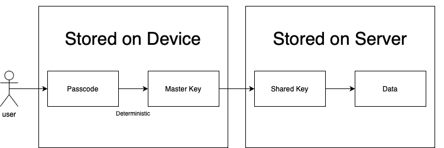

[Origin](https://quickbirdstudios.com/blog/end-to-end-encryption-implementation-approach/)

# End-to-End Encryption: A Modern Implementation Approach Using Shared Keys
## Introduction
* End-to-end encryption (E2EE), is about some form of data 
    - Be encrypted at a location 
    - Be able to travel to an endpoint location without being decrypted or revealed,
* The starting point is usually a user’s device 
* The endpoint is usually the device of same user or someone they want to share data with.

## Problems to Solve
* Only user can read the data
* Even if someone has access to the server, the information they can see will be useless to them
* All of user's devices are supported (PC, Phone, Watch)
* A way to recover data, in case user loses his devices

## Pieces of the Process
#### Passcode
* __BIP39__ originated in the Bitcoin world
    - Be the de facto standard for generating and managing encryption keys in cryptocurrency wallets
    - It generates randomized data which is then represented by a mnemonic phrase which means a human-readable string of words. 
    - Examples:
    
```
narrow swing either holiday own rice nothing guitar fitness carpet public session object ankle kitchen
   
note fame mother rare uncle join delay toddler collect dove state siege series leaf sample

candy sweets toffee gum caramel marshmallow sugar desert bonbon honey delicious syrupy treat crunchy chocolate      
```

* User would only need to enter their information again on another device and then the key would be usable in both places. 

#### Master Key
* Get a key from our passcode. It's called _Master Key_
    - Deterministic
    - Should never leave the device it's generated on
    - Avoid storing it on any device at all
    
#### Shared Key
* This key will be totally randomized
    - meaning it can be re-randomized
* It will be stored on Quickbird’s server 
    - Shared with every device a user logs in with 
    - Every device is always using the same key to encrypt and decrypt its data. 
* Since it’ll be leaving user’s device
    - Needs to make sure that it leaves encrypted 
    - Nothing can decrypt it until it reaches its proper destination. 
    - That is what we will use as the master key. 
        - Its only purpose will be to encrypt and decrypt the shared key on a user’s device.

## Bring It All Together
    

    
