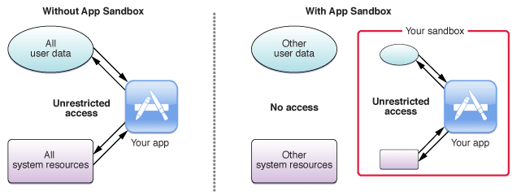
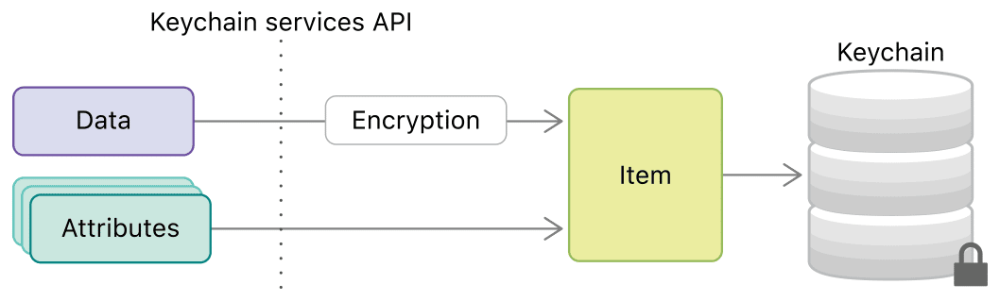
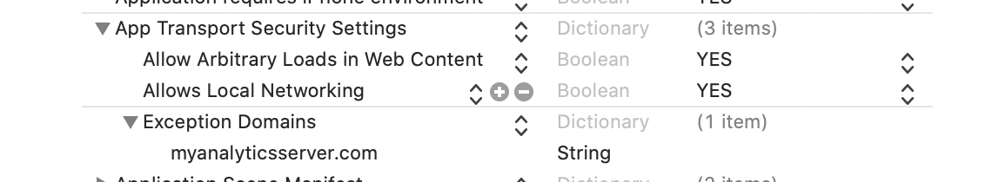
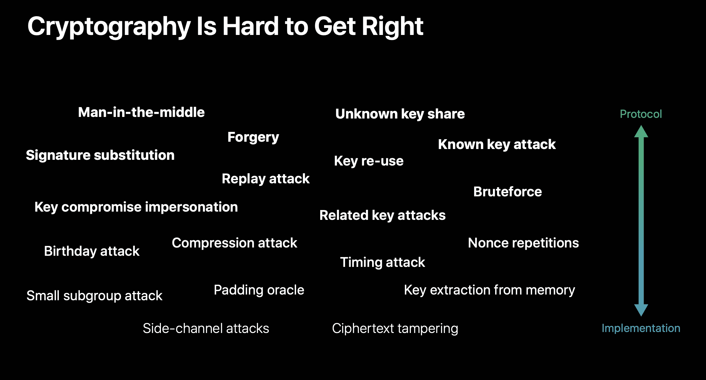
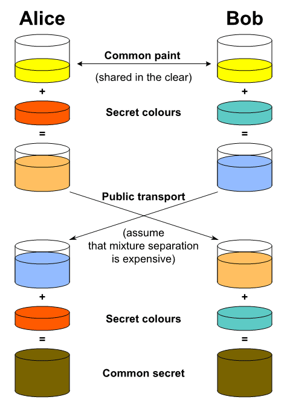

[Origin](https://quickbirdstudios.com/blog/ios-app-security-best-practices/)

# iOS App Security: Best Practices
## Introduction
Concrete techniques for making your iOS apps more secure

## The basic of iOS App Security
* Storing user data safely
* Secure data transporation
* How to use Apple's new cryptographic APIs
* [Secure Enclave](https://support.apple.com/vi-vn/guide/security/sec59b0b31ff/web)


## Best practices for storing user data
#### Apple's App Sandbox

 
* Be powered by UNIX’s user permissions
* [Entitlements](https://developer.apple.com/library/archive/documentation/Miscellaneous/Reference/EntitlementKeyReference/Chapters/AboutEntitlements.html)
    - Performing specific privileged operations
        - Examples: HealthKit, audio input         
    - Get signed together with the app and are not changeable
* [Extensions](https://developer.apple.com/app-extensions/)
    - OS has many points to be used by app extensions
    - Single-purpose executables bundled with the app
    - Run in their own address space and get controlled by the OS.
* Address space layout randomization

#### Data Protection API
* A [built-in security feature](https://developer.apple.com/documentation/uikit/protecting_the_user_s_privacy/encrypting_your_app_s_files)
    - Encrypt and Decrypt the files stored in their app directory
    - __NSFileManager, CoreData, NSData,__ and __SQLLite__
* Every file can be configured to use one of 4 available protection levels. 
    - __No Protection__
        - Always accessible and not encrypted
    - __Complete until first user authentication__
        - Decrypts the file after the user unlocks device for the first time
        - Stays decrypted until the device gets rebooted
    - __Complete unless open__
        - Encrypted until the app opens the file for the first time
        - Decryption stays alive even when the device gets locked by the user      
    - __Complete__            
        - Only accessible when the device is unlocked
        
```swift
try data.write(to: fileURL, options: .completeFileProtection)
// Or

try (fileURL as NSURL).setResourceValue( 
                  URLFileProtection.complete,
                  forKey: .fileProtectionKey)
```    

#### Keychain

* A hardware-accelerated secure data storage that encrypts all of its contents
* Used by the system to store data like passwords and certificates 
    - App developer has also access to this data storage.
* App or app group has its own space in the keychain and no other app has access to it
* _NSUserDefaults_ are not encrypted at all and should be avoided for sensitive data.
* Local keychain or iCloud Keychain    

```swift
let query: [String: Any] = [
    kSecClass as String: kSecClassInternetPassword,
    kSecAttrAccount as String: account,
    kSecAttrServer as String: server,
    kSecValueData as String: password
]
let status = SecItemAdd(query as CFDictionary, nil)
```

## Best practices for Secure Data Transportation

#### HTTPs
* [App Transport Security (ATS)](https://developer.apple.com/documentation/bundleresources/information_property_list/nsapptransportsecurity)
    - Blocks insecure connections by default. 
    - Requires all HTTP connections to be performed using HTTPS secured with TLS.



* If app contains an in-app browser 
    - Should use the _NSAllowsArbitraryLoadsInWebContent_ configuration 
    - Allows your users to browse the web normally 
    - Still makes sure that all other network connections in app use the highest security standards.

#### SSL Pinning
* Prevent man-in-middle attack
* [SSL or Certificate Pinning](https://owasp.org/www-community/controls/Certificate_and_Public_Key_Pinning)
* [TrustKit](https://github.com/datatheorem/TrustKit)
* [Apple’s technical note on HTTPS Server Trust Evaluation](https://developer.apple.com/library/archive/technotes/tn2232/_index.html)

#### Push Notifications
* [APNS services](https://developer.apple.com/documentation/usernotifications)
    - [UNNotificationServiceExtension](https://developer.apple.com/documentation/usernotifications/modifying_content_in_newly_delivered_notifications)
```swift
class NotificationService: UNNotificationServiceExtension {
    override func didReceive(_ request: UNNotificationRequest, withContentHandler contentHandler: @escaping (UNNotificationContent) -> Void) {
        guard let mutableContent = request.content.mutableCopy() as? UNMutableNotificationContent else {
            fatalError("Cannot convert notification content to mutable content")
        }
        mutableContent.title = decryptText(mutableContent.title)
        mutableContent.body = decryptText(mutableContent.body)
        contentHandler(mutableContent)
    }
    // ...
}
```

#### End-to-end encryption
* [Implementation of E2EE](https://quickbirdstudios.com/blog/end-to-end-encryption-implementation-approach/)
    - Be encrypted at a location 
    - Be able to travel to an endpoint location without being decrypted or revealed

#### CloudKit
* Allows you to store data in iCloud containers 
    - Using Apple ID as the login mechanism 
    - Don’t need to implement all of these services on your own.
* Completely free of charge to a certain amount

## Using cryptographic APIs


* APIs to handle common cryptographic tasks
* [Apple CryptoKit](https://developer.apple.com/documentation/cryptokit)
    - Introduced in iOS 13
    - Also allows you to use the SecureEnclave
* [CryptoSwift](https://github.com/krzyzanowskim/CryptoSwift) supporta older iOS versions

#### Hashing data
```swift
let data = ...
let dataDigest = SHA512.hash(data: data)
let hashString = dataDigest.description
```

#### Authenticating Data using Message authentication codes
```swift
let key = SymmetricKey(size: .bits256)
let authenticationCode = HMAC<SHA256>.authenticationCode(for: messageData, using: key)
```

#### Encrypting Data using symmetric keys
```swift
let encryptedData = try! ChaChaPoly.seal(data, using: key).combined
// Or
let sealedBox = try! ChaChaPoly.SealedBox(combined: encryptedData)
let decryptedData = try! ChaChaPoly.open(sealedBox, using: key)
```

#### Performing Key Agreement


* Create private/public key-pairs for Alice and Bob
```swift
let alicePrivateKey = P256.KeyAgreement.PrivateKey()
let alicePublicKey = alicePrivateKey.publicKey

let bobPrivateKey = P256.KeyAgreement.PrivateKey()
let bobPublicKey = bobPrivateKey.publicKey
```

* Deriving shared secret
```swift
let aliceSharedSecret = try! alicePrivateKey.sharedSecretFromKeyAgreement(with: bobPublicKey)

let bobSharedSecret = try! bobPrivateKey.sharedSecretFromKeyAgreement(with: alicePublicKey)
```

* Generate a much larger and more secure encryption key 
    - Using HKDF or X9.63 key derivation
```swift
let usedSalt = "Secure iOS App".data(using: .utf8)!
let symmetricKey = aliceSharedSecret.hkdfDerivedSymmetricKey(
    using: SHA256.self,
    salt: protocolSalt,
    sharedInfo: Data(),
    outputByteCount: 32
)
```

#### Creating and Verifying Signatures 
* A private/public key pair
```swift
let signingKey = Curve25519.Signing.PrivateKey()
let signingPublicKey = signingKey.publicKey
```

* Using the private key any form of data can be signed.
```swift
let data = ...
let signature = try! signingKey.signature(for: data)
```

* Signature is then sent together with the actual data
```swift
let isSignatureValid = signingPublicKey.isValidSignature(signature, for: data)
```
 
