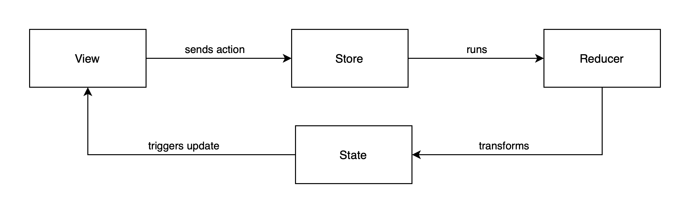

[Origin](https://www.kodeco.com/24550178-getting-started-with-the-composable-architecture)

# Getting Started With The Composable Architecture
## Introduction
* With SwiftUI and Combine popping up in more and more apps, managing state is becoming more important. 
* The Composable Architecture (TCA) is a framework providing many useful tools. 
* TCA focuses on state management, composition and testing.

## Exploring the Composable Architecture
* State management
    - Each app consists of some sort of state    
* Composition
    - Develop smaller features in isolation 
    - Compose them together to form the whole app
* Side effects
    - TCA defines a way to handle them.
* Testing
    - Makes it easy to accomplish.
* Ergonomics
    - A framework is available that provides a convenient API to implement all components.

#### Understanding the Components of TCA
* State
    - A collection of properties represents the state of an app or a feature spread over many classes. 
* Actions
    - An enumeration including cases for all events that can occur in app
* Environment:
    - A type wrapping all dependencies of app or feature. 
    - For example: API clients with asynchronous methods.
* Reducer
    - A function that uses a given action to transform the current state to the next state.
* Store
    - A place UI observes for changes and where you send actions

#### Advantages
* The data flow through the different components is clearly defined and unidirectional.
* The environment contains all dependencies. 
    - Understand and manage connections to the outside world from one single place.
    - Switch a live environment with a development or test environment 
    - Configure or mock your dependencies without much effort
* By composing separate features together
    - Each feature can be planned, built and tested on its own
* Only reducers transform the state by processing actions
    - Testing a feature boils down to running the reducer with actions and comparing the resulting state with the expectation.

## Using the Composable Architecture

#### Modeling States and Actions
* __RepositoryState__
```swift
var repositories: [RepositoryModel] = []
var favoriteRepositories: [RepositoryModel] = []
```

* __RepositoryAction__
```swift
// 1
case onAppear
// 2
case dataLoaded(Result<[RepositoryModel], APIError>)
// 3
case favoriteButtonTapped(RepositoryModel)
```

#### Accessing the Store From Views



* __RepositoryView__

```swift
let store: Store<RepositoryState, RepositoryAction>
let repository: RepositoryModel
```

```swift
WithViewStore(self.store) { viewStore in
```

```swift
if viewStore.favoriteRepositories.contains(repository) {
```

#### Sending Actions to the Store
* __RepositoryView__

```swift
action: { viewStore.send(.favoriteButtonTapped(repository)) },
```

#### Handling Side Effects
* Reducers transform the current state based on actions
    - Rarely does an app consist only of internal actions
    - Needs some way to access the outside world, e.g., API requests
* __RepositoryEffects__

#### Managing Dependencies With an Environment
* Environment holds all dependencies the app has in the form of effects
* __RepositoryEnvironment__
```swift
// 1
var repositoryRequest: (JSONDecoder) -> Effect<[RepositoryModel], APIError>
// 2
var mainQueue: () -> AnySchedulerOf<DispatchQueue>
// 3
var decoder: () -> JSONDecoder
```

#### Transforming State With Reducers
* _Reducer_ is a struct containing a function with the signature:
```swift
(inout State, Action, Environment) -> Effect<Action, Never>
```

```swift
// 1
let repositoryReducer = Reducer<
  RepositoryState,
  RepositoryAction,
  RepositoryEnvironment> 
  { state, action, environment in
  switch action {
  // 2
  case .onAppear:
    return environment.repositoryRequest(environment.decoder())
      .receive(on: environment.mainQueue())
      .catchToEffect()
      .map(RepositoryAction.dataLoaded)
  // 3
  case .dataLoaded(let result):
    switch result {
    case .success(let repositories):
      state.repositories = repositories
    case .failure(let error):
      break
    }
    return .none
  // 4
  case .favoriteButtonTapped(let repository):
    if state.favoriteRepositories.contains(repository) {
      state.favoriteRepositories.removeAll { $0 == repository }
    } else {
      state.favoriteRepositories.append(repository)
    }
    return .none
  }
}
```

## Composing Features
* _RootFeature.swift_

#### Sharing Dependencies With SystemEnvironment
* Share the same dependencies between separated features 
* __SystemEnvironment__ holds all shared dependencies
    - _DispatchQueue_
    - _JSONDecoder_
    -  May also wrap a sub-environment like _RepositoryEnvironment_


#### Combining States and Actions
* Add all of the repository feature’s state and actions to the root state

```swift
struct RootState {
  var userState = UserState()
  var repositoryState = RepositoryState()
}

enum RootAction {
  case userAction(UserAction)
  case repositoryAction(RepositoryAction)
}
```
#### Adding Views to the App

#### Composing Reducers
* Add `repositoryReducer` to `rootReducer`
* __combine__
    - Creates a new reducer by combining many reducers
    - Executes each given reducer in the order they are listed
* __pullback__
    - Transforms a given reducer so it can work on global state, actions and environment
    - _Parameters_
        - __toLocalState:__
        - __toLocalAction:__
        - __toLocalEnvironment:__
        
```swift
let rootReducer = Reducer<
  RootState,
  RootAction,
  SystemEnvironment<RootEnvironment>
>.combine(
  userReducer.pullback(
    state: \.userState,
    action: /RootAction.userAction,
    environment: { _ in .live(environment: UserEnvironment(userRequest: userEffect)) }),
  // 1
  repositoryReducer.pullback(
    // 2
    state: \.repositoryState,
    // 3
    action: /RootAction.repositoryAction,
    // 4
    environment: { _ in
      .live(
        environment: RepositoryEnvironment(repositoryRequest: repositoryEffect))
    }))
```

## Testing Reducers

#### Creating a TestStore

#### Testing Reducers Without Effects

#### Testing Reducers With Effects

#### Understanding Failing Tests


