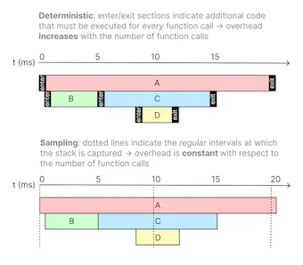
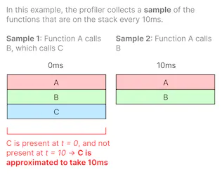
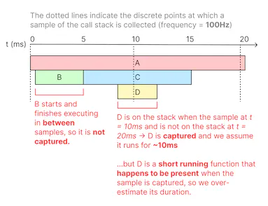
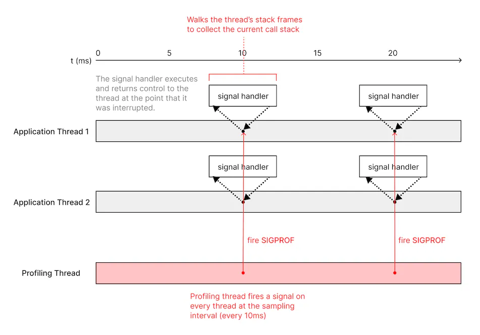
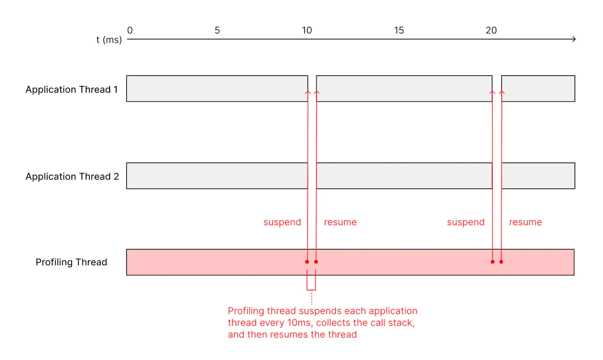
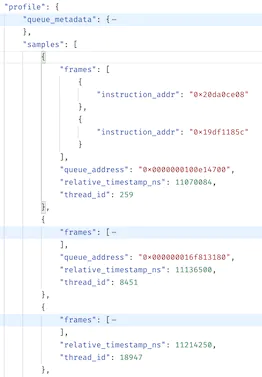

[Link](https://sentry.engineering/blog/building-a-performant-ios-profiler)

# Building a Performant iOS Profiler
## Introduction
* Profilers measure the performance of a program at runtime 
    - By adding instrumentation to collect information about the frequency and duration of function calls
* We’ll walk through how we built Sentry’s iOS profiler
    - Be capable of collecting high quality profiling data from real user devices in production with minimal overhead.

## Types of profilers
### Deterministic profilers
* Prioritize accuracy over performance
    - By capturing information about all function calls.

### Sampling profilers
* Collect samples at a fixed interval 
    - To limit performance overhead at the cost of only collecting approximate data about function execution

* Our goal was to build an iOS profiler 
    - Low enough overhead that it could run in production apps with minimal impact to user experience
    - Which meant that we had to build a sampling profiler. 
* iOS’s sandboxing limitations
    - The profiler also had to be able to run in-process in the profiled application rather than as an external process.

## How sampling profilers work in-depth
#### A common type of statistical profiler 
* Collects profiling data by periodically collecting samples of the call stacks on each thread 
* And interpolating function durations between samples.

#### The frequency of the profiler determines the granularity of the data
* A profiler sampling at 100Hz will capture samples every 10ms.
* Functions that run shorter than 10ms
    - Either not be captured at all if they start and finish execution in between samples
    - Or be captured but have an inaccurate duration of 10ms if they executed overlapping two samples.
    

## The first approach: signal handlers
#### Use a signal handler to collect the call stack from each thread.
* Having a dedicated sampling thread that fires a signal (_SIGPROF_ in this case, a signal specifically intended for profiling) on each thread at the sampling interval
* Collecting the backtrace from inside the signal handler.

#### Drawbacks
* __pthread_kill__
    - Intentionally returns an error when firing on worker threads managed by GCD
* Use __syscall__ instead
    - Deprecated as of iOS 10.0.
* The call stack had to be captured inside a signal handler
    - Limited to using only a small subset of APIs that were considered _“async-signal-safe”_
* Signal delivery was unreliable. 
    - Difficulty collecting any samples or the gaps between samples were too large

## Second approach: Mach thread suspend
* Apple’s Darwin kernel has its own set of APIs for managing threads
* __thread_suspend__ and __thread_resume__ APIs
    - Allow suspending a thread to collect its call stack 
    - Resume it afterwards. 

* We can now collect the stacks of GCD-managed threads
* Thread suspension works more reliably.

## Capturing the call stack
* Two common approaches for walking the stack
    - By starting with the frame pointer and reading parent frames on the stack by following the linked list of frames
    - Or by reading DWARF
#### Frame pointer approach
* The simplest to implement
* Only works if the the binary is compiled with frame pointer support
* We can assume that if we are running on iOS
    - A frame pointer will likely be present
    - Instead of implementing a more complicated DWARF-based stack walking implementation.
* Steps
    - Thread is suspended
    - Use __thread_get_state__ to dump the register state of each thread
    - Read the frame pointer
    - Each stack frame contains a pointer to the stack frame of the caller
    - The stack walking implementation is a loop 
        - Starts with the frame pointer 
        - Follows the linked list of frames to collect a list of function addresses

## Putting together the profile
* An iOS profile payload is simply a timestamped series of samples (call stacks), grouped by thread ID:

* The payload is sent by the Sentry SDK to Sentry’s backend 
* At Backend, perform post-processing 
    - Symbolicate the function addresses 
    - Compute the differences between samples to determine function call durations
    - Render a visualization called a flamechart that allows a developer to navigate the function call data over the time axis, separated by thread.

