[Origin](https://www.rea-group.com/about-us/news-and-insights/blog/from-monolith-to-micro-frontends-how-we-revolutionised-rea-mobile-app-development/)

# From Monolith to Micro-frontends_ How we Revolutionised REA Mobile App Development
## Introduction
* The mobile timeline at REA.

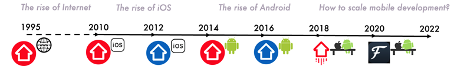

## The Residential App Timeline

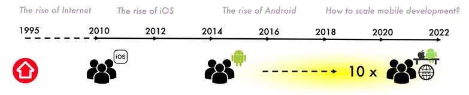

## Goals and Guides.

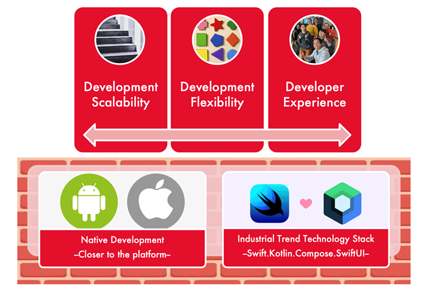

#### Goals
* Development Scalability 
    - As we need more features, we can easily add them scalably
* Development Flexibility 
    - Teams have the flexibility and autonomy for tech and design evolvement without stepping on each other toes.
* Developer Experience 
    - Developers have great development experience, and love to contribute to the code base.

#### Guidelines
* Get as close as possible to the platform in our mobile development
    - As it is more reliable in a long run. 
    - Use the Android and iOS native development platform.
* Use the latest industry trend technology stack. 
    - All new features to use Swift and SwiftUI for iOS development
    - Kotlin and Jetpack Compose for our Android Development.

## The Three Eras

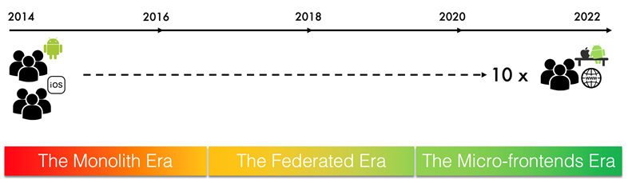

## The Monolith Era

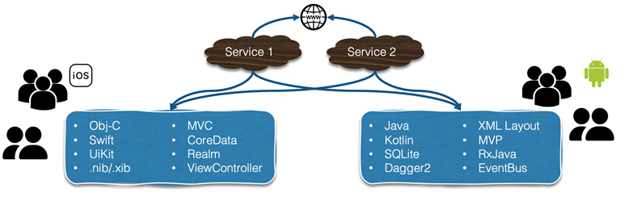

#### Some issues

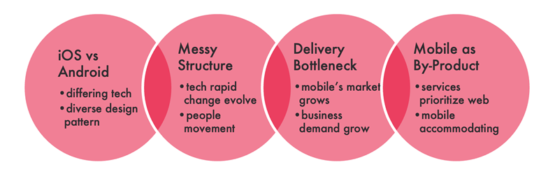

* iOS and Android teams are vastly different
    - Different architecture and code structure
* With people movement, our code structure turns messy.
* Mobile industry continue to grow
    - A single team of mobile development is a bottleneck to delivery
* Mobile is still a byproduct served by common Services for the web.

## The Federation Era

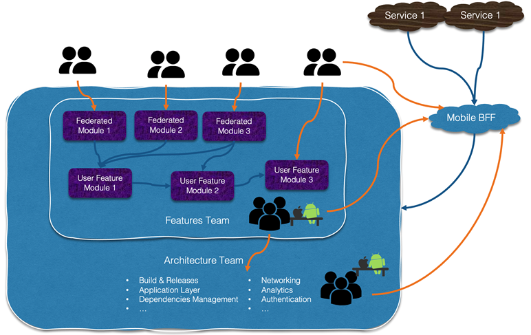

* Combine the iOS and Android team to form an Architecture team. 
    - Also responsible for Mobile Backend for Frontend - BFF
* A Feature Team that is responsible for all the user facing features development. 
    - Also a joint iOS-Android team structure.
* Allow teams from other businesses to contribute to our code base.
    - They build federated modules
    - Over time, also contributed to the feature.

#### How Federation Era Helps.

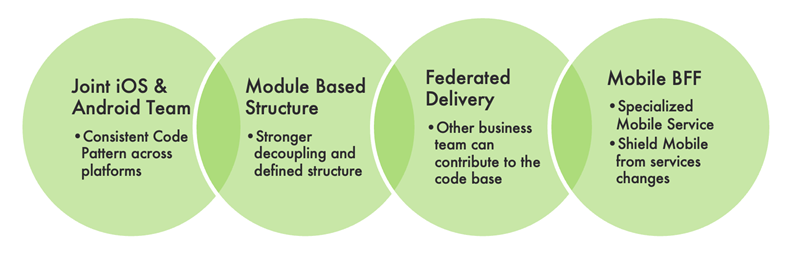

#### Challenge With Federation Era.
    
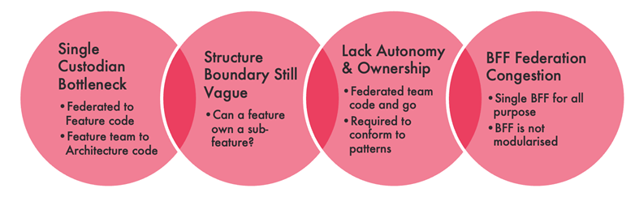

* Still a single code base for both architecture and federation
* The boundary is still relatively vague. 
    - What is called a feature, what’s called a sub-feature?
* The federated team need to conform to restrictive pattern. 
    - They come and go, and never have sense of ownership
* Mobile BFF are not designed for federation.

## The Micro-Frontends Era.
* Come from micro-services
* Different from modular development
    - The keyword is __independently deverable frontend applications.__
* Instead of building a big house
    - Build small houses together 
    - Combine them together for a collaborated functionality.

#### App as a Platform

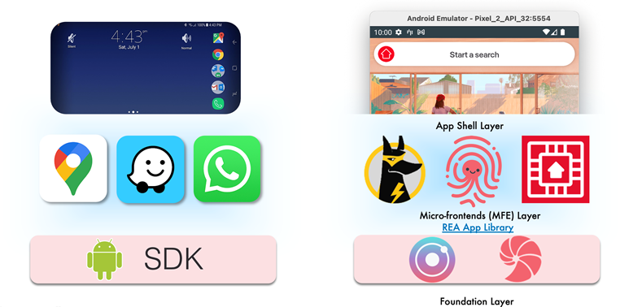

* Treat our App as a Platform. 
    - A top layer, App Shell Layer.
* If any business like to add a feature into the App, 
* Foundation Layer
    - Foundation libraries provided
    - Any business need to build their feature using our Foundation Layer

#### The App Shell Layer

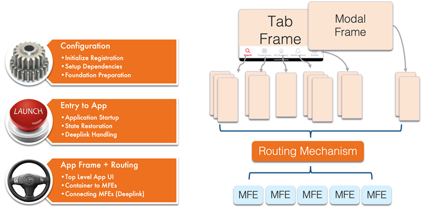

* Configure all the initial need of the App
* The entry to the App
* AppFrame and Routing. 
    - Host the MFEs and show it

#### AppFrame and Routing

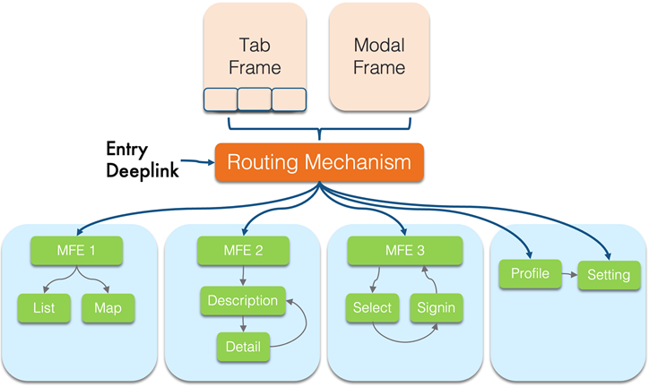

* A list of MFEs
    - Can be placed in the respective compartment in the AppFrame through the routing mechanism we have
    - Each of them is a User Experience itself, rather than a single screen.    

#### The MFE Layer

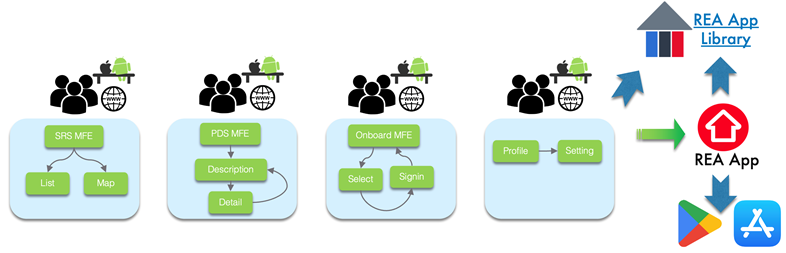

* Each of these MFE are fully owned by the business unit responsible for the feature
    - Can all be compiled as individual app
    - Shipped to the REA App Library for testing purposes
    - Upon ready, all bundled together and compiled into main App

#### Aligned Autonomy.

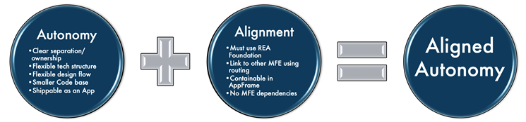

* AUTONOMY
    - Clear separation and ownership
    - The flexibility of Tech Structure, and it’s design
    - Smaller code base, easier to work with
    - Each is shippable as an App by itself
* ALIGNED,
    - Have to use REA Foundation
    - Linked to other MFE using routing and containable in AppFrame
    - No MFE Should be dependent on each other

#### No MFE Dependencies

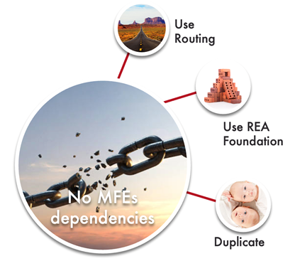

* Use Routing
* Use REA Foundation
* Or even at time duplicate the functionality across the MFEs

#### MFE Component Sharing

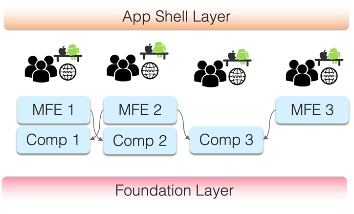

* Some team doesn’t need any full screen feature
    - But leverage the other MFE’s screen to show their part
* Two layers (MFE Screen and MFE Component) then form MFE layer.

#### The Foundation Layer

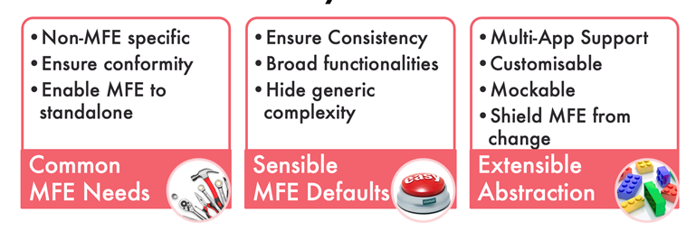

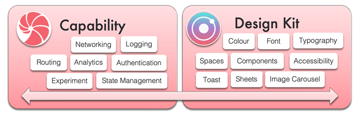

* Two distinct foundations that form this Layer
    - Capability
    - Design Kits

## Extensibility of Foundation and MFE.

* The foundation is created are not meant for just one App usage within REA.

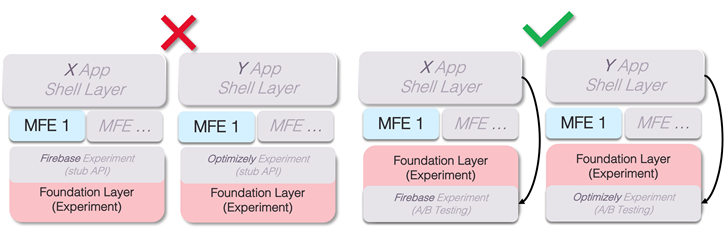

#### Non-extensible design

 * MFE 1 linkage to the foundation has to tied to either Firebase or Optimizely. 

#### Extensible design

* To avoid this issue, we need to design our foundation in a reverse manner

#### How are we Doing?

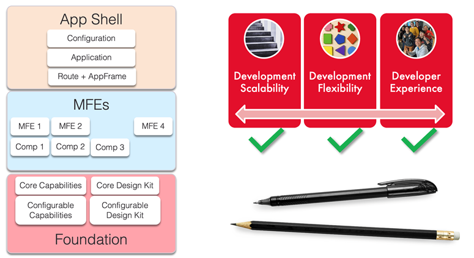

* It is scalable. 
    - Just need to add new MFEs as new User Experience to the App easily
* Independent from each other and have flexibility
* Developer are also pretty happy working on the MFE
    - Just focus on the User Experience. 
    - Can explore free to explore new tech introduced.

## Two Steps Forward One Step Back

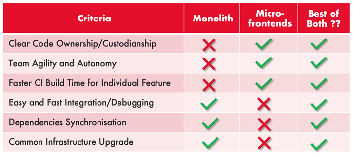