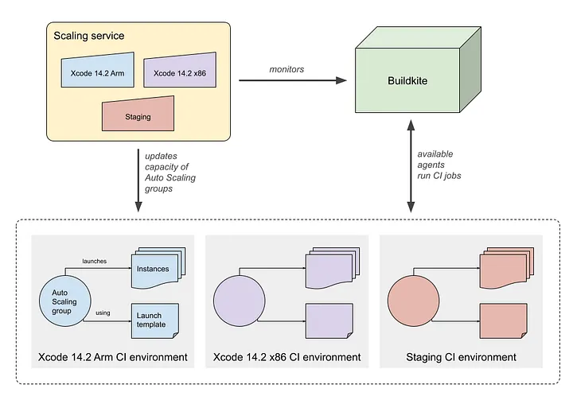

[Link](https://medium.com/airbnb-engineering/flexible-continuous-integration-for-ios-4ab33ea4072f)

# Flexible Continuous Integration for iOS
## Introduction
How Airbnb leverages AWS, Packer, and Terraform to update macOS on hundreds of CI machines in hours instead of days

## The Challenges with Running CI on Physical Macs
* An iOS infrastructure engineer individually logged into over 300 machines to perform administrative tasks
* Old CI machines were rarely restarted and too often drifted into a bad state. 
* Updating to a new version of Xcode was quite error-prone as well.

## Upgrading CI with Custom macOS AMIs
#### Amazon Machine Images (AMIs).
* A snapshot of an instance’s state, including its file system contents and other metadata.
    - Amazon provides base AMIs for each macOS version
    - Allow us to add new instances to our fleet without human intervention
* An engineer would configure a single instance and create an AMI from that instance’s state.
    - A major improvement over managing physical machines
* Build AMIs using Packer.

```
$ time ./make_ami.rb \
    --instance-type mac2.metal \
    --source-ami macos_arm_autologin_enabled \
    --xcode-version 'Xcode 14.2.0 (14C18)'
# real  60m21.652s
# user  0m41.418s
# sys	0m32.152s
```

## Defining CI Environments in Terraform
* The central AWS component of each CI environment is an Auto Scaling group
* All of our AWS infrastructure for iOS CI is specified in Terraform code that we check into source control
* Define a Terraform module that we can call whenever we want to instantiate a new CI environment

```
module "ios-ci-arm-xcode-14-2" {
  source = "../modules/ios-platform"

  instance_type              = "mac2.metal"
  launch_template_version    = 23
  ami_filter                 = "ios-ci-xcode_14_2_0-*"
  max_num_instances          = # redacted
  max_num_instances_weekends = # redacted

  buildkite_tags = {
    queue = "ios-ci-arm-xcode-14-2"
  }

  # additional configuration excluded for brevity
}
```

* An internal scaling service manages the desired capacity of each environment’s Auto Scaling group.
    - A modified fork of buildkite-agent-scaler
    - Increases the desired capacity of an environment’s Auto Scaling group as CI job volume for that environment increases



* Each CI environment has a unique Buildkite queue name
* Individual CI jobs can target instances in a specific environment by specifying the corresponding queue name
* Jobs will fall back to the default CI environment when no queue name is explicitly specified.

#### Benefits of Our New iOS CI System
* Able to support an arbitrary number of CI environments with minimal overhead

#### Rotation of Instances Increases CI Consistency
* To minimize the opportunity for EC2 instances to drift, we terminate all instances each night and replace them daily. 
    - We can be confident that our CI fleet is in a known good state at the start of each day

#### We Ship Xcode Versions More Quickly

## The Migration is Complete
* Our new CI system ran over 10 million minutes of CI jobs in the last three months of 2022
* After the migration to AWS, iOS CI benefits more from shared infrastructure that is already being used successfully within Airbnb. 
