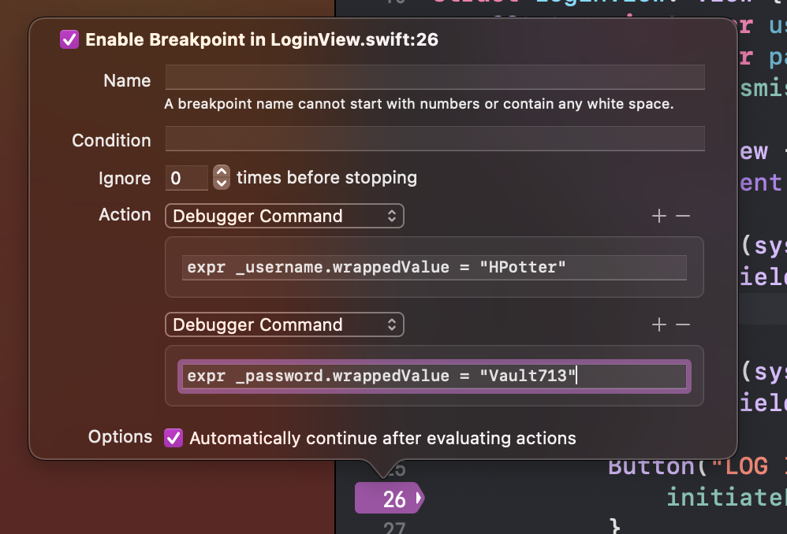
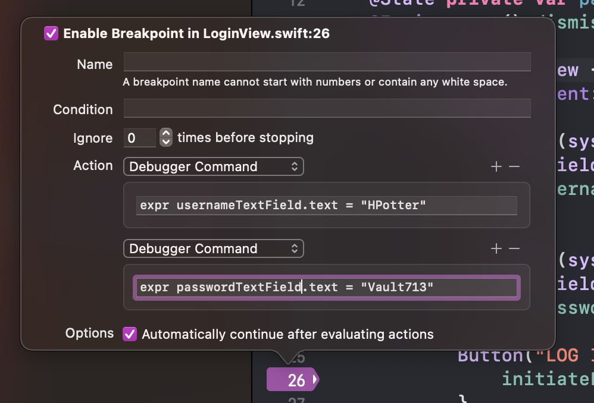

[Link](https://www.danijelavrzan.com/posts/2023/04/login-xcode-breakpoint/)

# Skip typing your login credentials manually with Xcode breakpoints
## Introduction
In some cases, you can implement logic to skip the login screen entirely during development. But sometimes, you need to log in.

## Xcode breakpoints
With Xcode breakpoints you can set up your login credentials during development so you don't have to type them manually every time you run your app.

## Sample login code in SwiftUI

#### LoginView.swift

#### ContentView.swift

## Create a breakpoint
* Create a breakpoint on the login button's action
* __Edit Breakpoint__
    - __Action__ -> __Add Action__
    - __expr _username.wrappedValue = "[USERNAME]"__
    - __expr _password.wrappedValue = "[PASSWORD]"__
* Check the __Automatically continue after evaluating actions__

## Breakpoint expressions in UIKit

## Log in automatically without tapping the button
* Create a breakpoint in the __viewWillAppear()__ for __UIKit__ app or __.onAppear()__ for __SwiftUI__ app of your login view.
