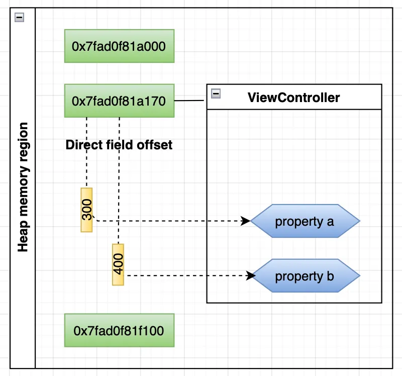
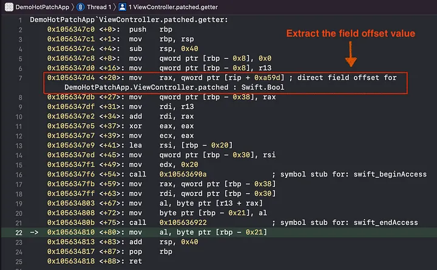

[Link](https://medium.com/@programmingpassion/low-level-ios-debug-direct-field-offset-316c01d041b9)

# iOS debug session - Direct field offset (Part 1)
## Introduction
A deep dive into the low-level debugging technique.

## What is Direct field offset?



* It tells the direct offset of property from the object base address

## Look through an example
```swift
class ViewController: UIViewController {
    
    @IBOutlet weak var contentLabel: UILabel!
    
    var patched = false
    
    override func viewDidLoad() {
        super.viewDidLoad()
        // Do any additional setup after loading the view.
    }

    @IBAction func onBtnTapped(_ sender: Any) {
        
        if patched {
            contentLabel.text = "Program is patched"
        } else {
            contentLabel.text = "Program is loaded"
        }
    }
    
}
```

* Set the breakpooint in the func __onBtnTapped__, and see how it accesses the __patched__ property

## Extract the field offset value



```
0x1056347d4 <+20>: mov rax, qword ptr [rip + 0xa59d]
```

* __rip__ 
    - The program counter
    - Point to the latest instruction address at where it’s currently executing
* __rip + 0xa59d__ 
    - The constant __0xa59d__ is calculated and fixed at compile time
    - To give a direct access to a constant in runtime. 
    - Pointing at the address where the direct offset value locates. 
    - The actual address is __0x1056347d4 + 0xa59d = 0x10563ed71__
* __qword ptr [rip + 0xa59d]__
    - Make reference to the address at __0x10563ed71__, and retrieve the actual value.
* __move rax__
    - Finally it copies the value to the register __rax__

## Access direct field offset
#### Just read the register
```
(lldb)register read rax
     rax = 0x0000000000000368
```

#### Read it from memory

```
(lldb) memory read 0x000000010563ed71+7 -fA
0x10563ed78: 0x0000000000000368
0x10563ed80: 0x00007fff862bc6c0 (void *)0x00007fff862bc6c0: NSObject
0x10563ed88: 0x00007fff864add60 (void *)0x00007fff862bc6c0: NSObject
0x10563ed90: 0x0000600003fe2400
0x10563ed98: 0x0007c0350000000f
0x10563eda0: 0x0000600000382920
0x10563eda8: 0x0000000000000000
0x10563edb0: 0x0000000000000000
```

#### Look it up from the MACH-O

## Access the property


```
 0x105634803 <+67>: mov    al, byte ptr [r13 + rax]
```

* __r13__
    - The register that keeps the address of the object.
* __rax__
    - Keeps the direct field offset value
* __r13 + rax__
    - The actual memory address the property locates at
* The whole instruction basically retrieve the value of the property at the target address, and store it in the register al
