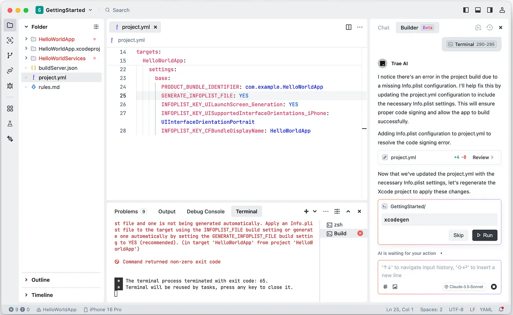

[Link](https://medium.com/@totidev/ios-development-with-trae-bc35f3f50a7c)

# iOS development with Trae
## Introduction
Trae, a new AI-powered IDE created by ByteDance. It currently supports Claude-3.5-Sonnet and GPT-4o

## Prerequisites
#### XCode
#### XCode Build Server
#### XCodeGen
#### xcbeautify

## Setup
Download it from https://www.trae.ai

#### Swift
```
trae --install-extension sswg.swift-lang
```
To support Swift language

#### Sweetpad
```
trae --install-extension sweetpad.sweetpad
```
To build and run Xcode projects in Trae

## Getting Started


* Currently it defaults to Claude-3.5-Sonnet
* Enter the command __Make a SwiftUI app called HelloWorldApp__

### Builder
* Repeat the previous command


* __But this is not what we want__
* Include a file about rules we want our generated code to conform to.

```swift
# Swift Rules

## Code Organization
- One type declaration per file
- Extensions must be placed in a separate file
- Protocols must be placed in a separate file

## Swift
- Prefer structs over classes
- Implement async/await for async operations

## Project
- Target iOS 18
- Use Swift 6
- Use swift-tools-version 6
```

* Name this file __rules.md__
* The prompt we'll use

```
Make a Swift package called HelloWorldServices. This should contain a service call for getting messages.
Use XcodeGen to generate a SwiftUI app called HelloWorldApp. This app must reference the local Swift package, HelloWorldServices to get and display the message.
I want to use this dependency: https://github.com/hmlongco/Factory
Follow the coding guidelines in rules.md
```

## Running the Project
### XcodeGen
* `Cmd+Shift+P`
* Type in `xcodegen`
* Select `SweetPad: Generate an Xcode project using XcodeGen`

### Build Server
* `Cmd+Shift+P`
* Type in `buildserver`
* Select `SweetPad: Generate Build Server Config (buildServer.json)`
* Choose `HelloWorldApp`


### Build (without run)


### Fix compile error



* Simply select the error and add it to the chat.
* Ensure that the Builder tab is selected, rather than Chat, if you want the agent to automatically correct the error.
* Some next errors, just add them to the chat and the agent will fix them
* The app now loads.

## Inline Chat
### Improve the code
* Selecting the code and pressing _Cmd+I_
* Describe what you want


* __Output:__
```swift
public func getMessage() async throws -> String {
    // Simulating network delay
    try await Task.sleep(for: .seconds(1))
        
    // Add error handling for potential network failures
    do {
        // In a real app, this would likely make an API call
        return "Hello, World!"
    } catch {
        throw MessageServiceError.networkError(error)
    }
}
```

### Explain the code
* Prompt: _What does this code do_
* __Output:__


